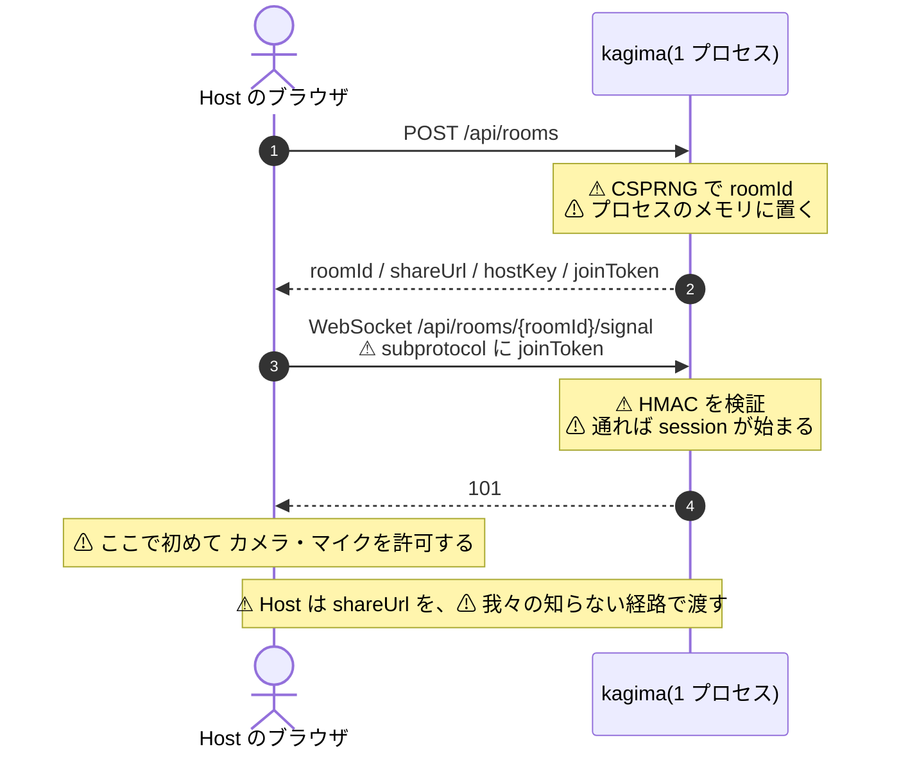
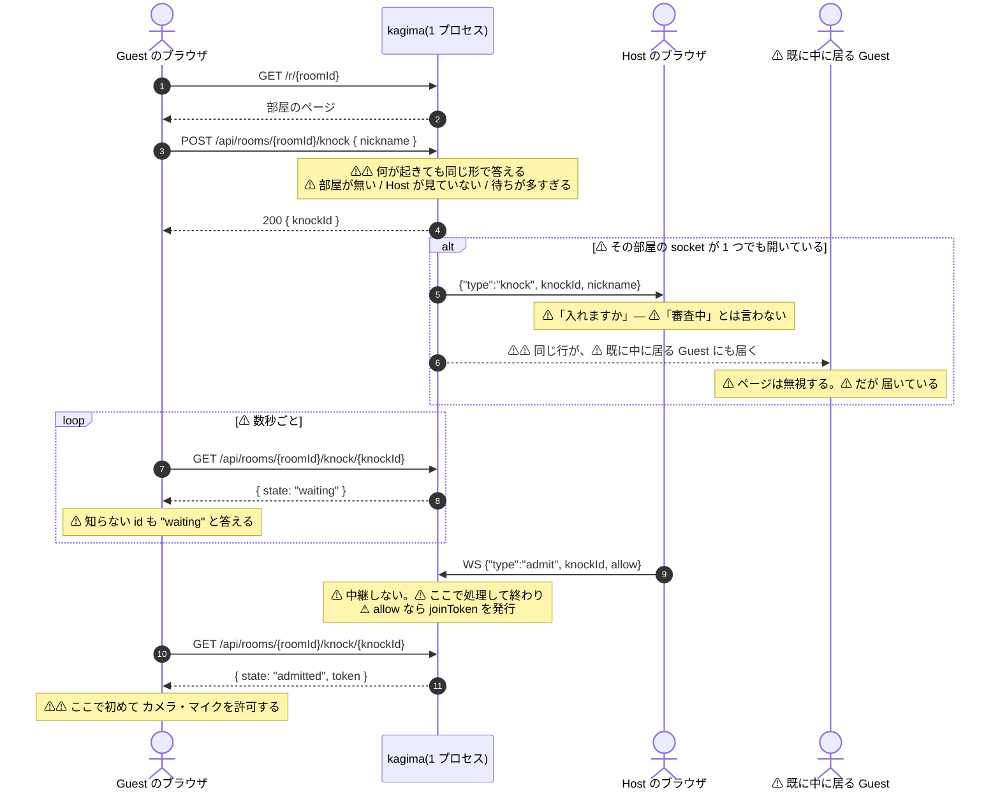
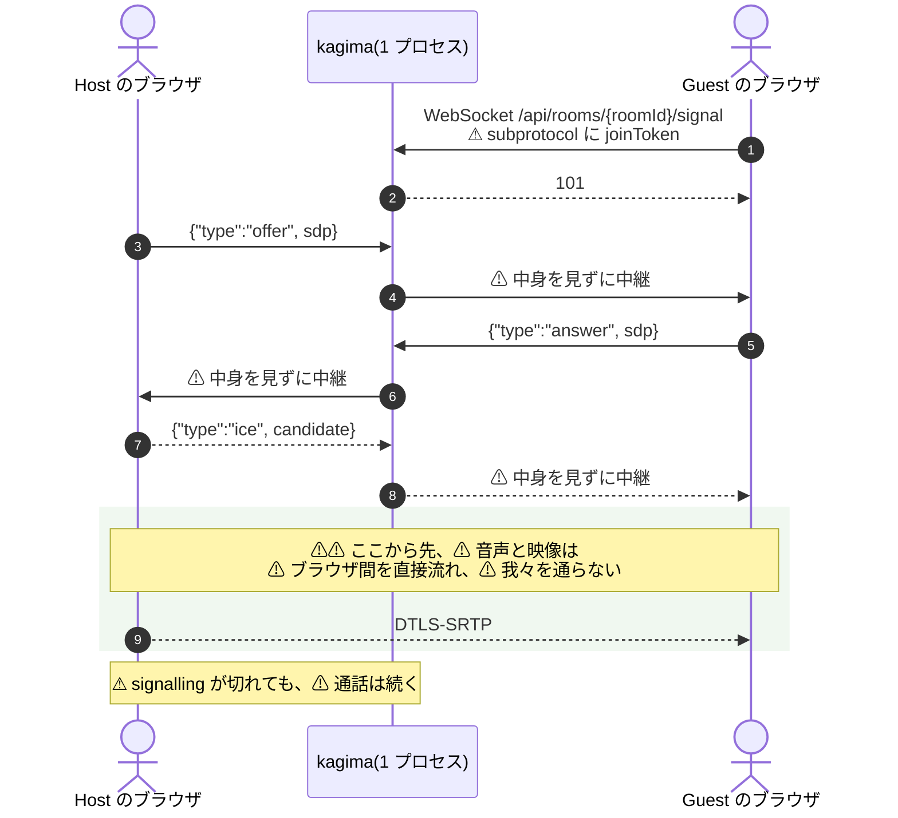
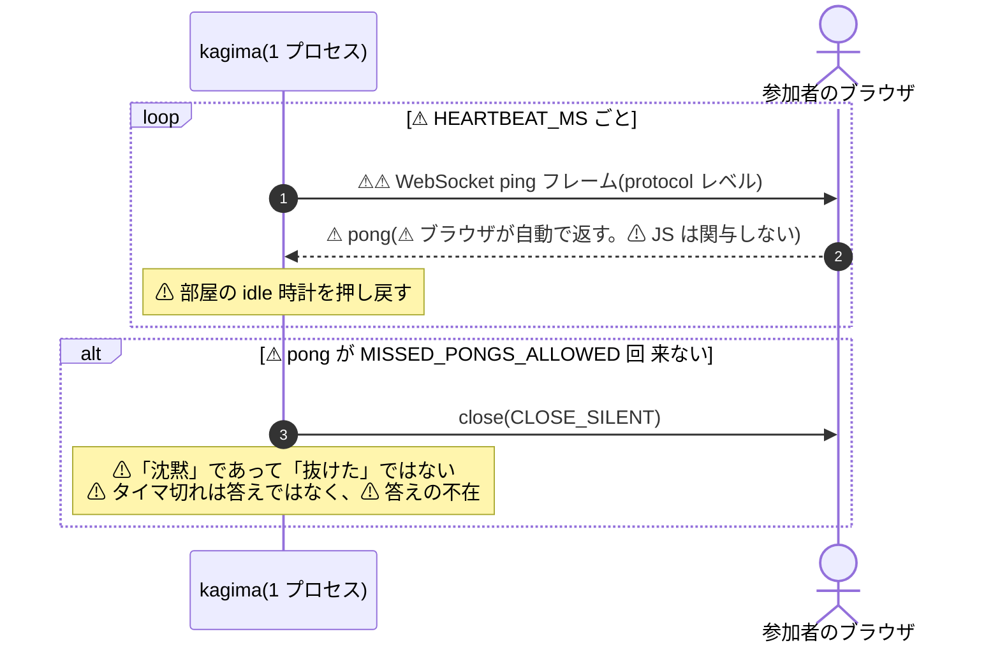
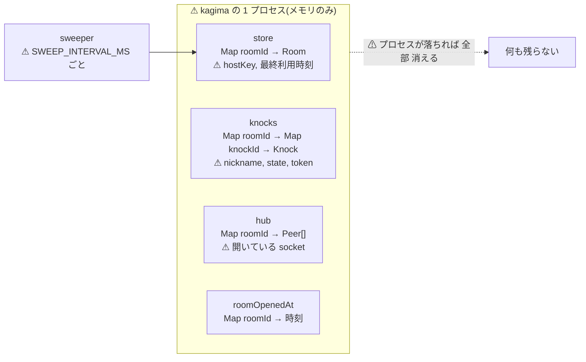

# いまの仕組みと、⚠ Cloudflare にそのまま載らないところ

- 日付: **2026-09-06**
- 目的: ⚠ **[kagima#62](https://github.com/hidetzu/kagima/issues/62)(心拍をどう果たすか)を
  Owner が判断するための材料**
- ⚠ **これは記録ではなく、⚠ いまのコードの見取り図である。**
  ⚠ **決定は [`adr/`](adr/)、⚠ 製品は [`PRODUCT.md`](PRODUCT.md)、⚠ 言えることは
  [`SPEC.md`](SPEC.md)。** ⚠ **ここはどれも言い直さない。**

> ⚠ **数はここに書かない**([`../.claude/rules/evidence.md`](../.claude/rules/evidence.md))。
> ⚠ **定数の値はコードが持ち、⚠ この文書は名前で呼ぶ。**

---

## 1. いまの仕組み

### 1-1. 部屋を作り、⚠ 招く



⚠ **`hostKey` と `joinToken` はここで一度だけ渡され、⚠ 二度と渡されない。**
⚠ **合言葉は無い**([`adr/0017`](adr/0017-let-the-host-decide-who-comes-in.md))。

### 1-2. ⚠ ノックと、⚠ Host の判断



⚠ **断られた / 部屋が閉じた / 待つ間に終わった、は Guest には 1 つの答えである**
([`adr/0017`](adr/0017-let-the-host-decide-who-comes-in.md))。

> ⚠⚠ **この図を描いていて見つけた。** ⚠ **ノックの通知は、⚠ その部屋の socket 全部に送られる**
> (`hub.announce`)。⚠ **so 既に中に居る Guest のブラウザにも、⚠ 3 人目の `nickname` と
> `knockId` が届く。** ⚠ **ページは無視するが、⚠ 無視することは 届いていないことではない。**
>
> ⚠ **`admit` は「中継しない」と決めてある** — ⚠ **`src/signaling/session.ts` に
> 「the other participant has no business learning who knocked or what was decided about them」
> と書いてある。** ⚠ **`knock` のほうは、⚠ その原則の逆をしている。**
>
> ⚠ **観測(2026-09-06): host と guest の両方が
> `{"type":"knock","knockId":"…","nickname":"さんにんめ"}` を受け取った。**
> ⚠ **プライバシーに触るので、⚠ 直さずに出した** —
> ⚠ **[kagima#64](https://github.com/hidetzu/kagima/issues/64)。**

### 1-3. ⚠ 通話そのもの — ⚠ 我々を通らない



### 1-4. ⚠⚠ 心拍 — ⚠ #62 の主題



⚠⚠ **ここが要点である。** ⚠ **`pong` はブラウザが プロトコルの仕様として 自動で返す。**
⚠ **ページの JavaScript は何も書いていないし、⚠ 書くことすらできない**
(⚠ ブラウザの WebSocket API に ping/pong は露出していない)。

⚠ **so いまの心拍は、⚠ 相手のページが壊れていても、⚠ フリーズしていても、
⚠「TCP とブラウザが生きている」ことだけを測っている。**

### 1-5. ⚠ 何を、どこに持っているか



⚠ **ディスクにも、データベースにも、キャッシュにも書かない**
([`adr/0005`](adr/0005-keep-room-state-in-process-memory-only.md))。

---

## 2. ⚠ そのまま載らないところ

⚠ **測ったものと、⚠ 読んで分かるものを、⚠ 分けて書く。**

### 2-1. ⚠ 測った(2026-09-06、`wrangler dev --local`、`spike/`)

| # | 何が | ⚠ 測った結果 | ⚠ 効き方 |
|---|---|---|---|
| 1 | ⚠⚠ **サーバ側 WebSocket の protocol ping** | ⚠⚠ **無い。** ⚠ `server.ping` は関数ですらなく、⚠ prototype の名前一覧にも無い | ⚠⚠ **§ 1-4 が丸ごと成立しない。** ⚠ **kagima#62** |
| 2 | ⚠ **モジュール読み込み時の乱数** | ⚠ **禁止。** ⚠ isolate ごと死ぬ | ⚠ **直した**(`docs/adr/0015` § 測った) |
| 3 | Web Crypto の join token | ⚠ 無改変で動く | ⚠ 無し |
| 4 | `crypto.getRandomValues` | ⚠ 無改変で動く | ⚠ 無し |
| 5 | `setInterval`(request handler の中) | ⚠ 使える。⚠ `unref` も在る | ⚠ 無し |

### 2-2. ⚠ 読んで分かる(⚠ まだ Worker では走らせていない)

| # | 何が | ⚠ なぜ載らないか | ⚠ 代わりに何が要るか |
|---|---|---|---|
| 6 | ⚠⚠ **プロセスのメモリにある 4 つの Map**(§ 1-5) | ⚠ **Worker は 1 リクエストごとに別の isolate でありうる。** ⚠ **「同じプロセス」という前提が無い** | ⚠ **Durable Object。** ⚠ **どう割るかは [kagima#47](https://github.com/hidetzu/kagima/issues/47) で未決** |
| 7 | ⚠ **`server.on("upgrade")` の 101 手渡し** | ⚠ `node:http` が無い | ⚠ `WebSocketPair` と `new Response(null, { status: 101, webSocket })`。⚠ **`spike/` で動いた** |
| 8 | ⚠ **`ws` の `WebSocketServer`** | ⚠ 同上 | ⚠ **継ぎ目は `SignalingSocket` に在る。** ⚠ アダプタ 1 枚 |
| 9 | ⚠ **`readFileSync` で `public/` と `dist/` を配る** | ⚠ ファイルシステムが無い | ⚠ Workers Assets、⚠ または埋め込み |
| 10 | ⚠ **`SWEEP_INTERVAL_MS` の掃除タイマ** | ⚠ **プロセスが常駐しない。** ⚠ **掃除する「常駐者」が居ない** | ⚠ DO の alarm、⚠ もしくは「読むときに期限を見る」 |
| 11 | ⚠ **`nextPeerId` の連番** | ⚠ **1 プロセス前提。** ⚠ 別 isolate では 1 から始まる | ⚠ DO の中なら成立する。⚠ **6 と同じ問題** |
| 12 | ⚠ **`roomOpenedAt` の計測** | ⚠ 同上 | ⚠ 同上 |

### 2-3. ⚠ 変わらないもの

⚠ **移植で 揺らがない と、⚠ いま言えるもの。**

```text
メディアが我々を通らないこと            ⚠ そもそもサーバを経由していない (adr/0001)
ノックの答えが 1 つであること            ⚠ handle() の中。⚠ Request/Response で書いてある
カメラが「入れると決まってから」なこと    ⚠ ブラウザ側。⚠ サーバの形と無関係
join token の検証                        ⚠ 測った。無改変で動く
```

---

## 3. ⚠ #62 を判断するために

⚠ **ping が無いことの実際の意味は、⚠ 「別の方法を用意する」ではなく、
⚠「いま測れているものと、⚠ 測れるようになるものが 違う」ことである。**

| | ⚠ いま(protocol ping) | ⚠ アプリケーション層にした場合 |
|---|---|---|
| 誰が返すか | ⚠ **ブラウザが自動で返す** | ⚠ **ページの JavaScript が返す** |
| ⚠ 何を測っているか | ⚠ **TCP とブラウザが生きている** | ⚠⚠ **ページが生きて動いている** |
| ⚠ ページがフリーズしたら | ⚠ **気づけない。** ⚠ pong は返り続ける | ⚠ **気づける** |
| ⚠ 相手が返さない自由 | ⚠ **無い**(⚠ プロトコルが返させる) | ⚠ **在る**(⚠ ただし返さねば切られるだけ) |
| ⚠ 実装の数 | ⚠ **Node だけ。** ⚠ Worker では書けない | ⚠ **1 つ**(`CLAUDE.md` § 3) |
| ⚠ クライアントの変更 | ⚠ 不要 | ⚠ **要る** |

⚠ **so これは「移植のための妥協」とは限らない。**
⚠ **アプリケーション層の心拍のほうが、⚠ 測っているものは 強い。**

⚠ **ただし、⚠ 強いほうが常に良いとは言っていない。**
⚠ **フレームが 2 つ増え、⚠ クライアントが変わり、⚠ 移植が終わるまでのあいだ心拍の実装が
2 つになる**(⚠ `CLAUDE.md` § 3 が最も嫌う形)。⚠ **どちらを取るかは測定では決まらない。**

⚠ **判断が要るのは、⚠ いま動いている Node 版の心拍を、⚠ まだ存在しない側に合わせて
先に変えるかどうかである** — ⚠ **[kagima#62](https://github.com/hidetzu/kagima/issues/62)
の案 3。**

---

## 4. ⚠ この文書が言っていないこと

- ⚠ **Durable Object の寿命と課金。** ⚠ **まだ DO を持っていない**([kagima#47](https://github.com/hidetzu/kagima/issues/47))。
- ⚠ **`handle()` 全体が workerd で走るか。** ⚠ **`src/server.ts` がまだ `node:http` を値として import する。**
- ⚠ **§ 2-2 は読んで分かることであり、⚠ 走らせて確かめたものではない。**
  ⚠ **§ 2-1 だけが測定である。**
- ⚠ **どの案が良いか。** ⚠ **ここは材料であって、⚠ 判断ではない。**
